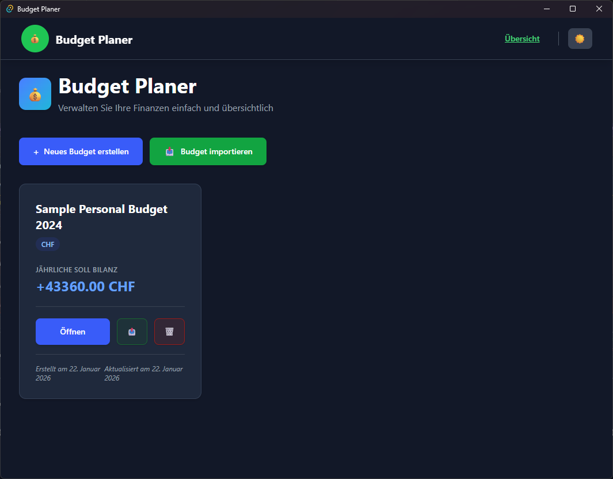
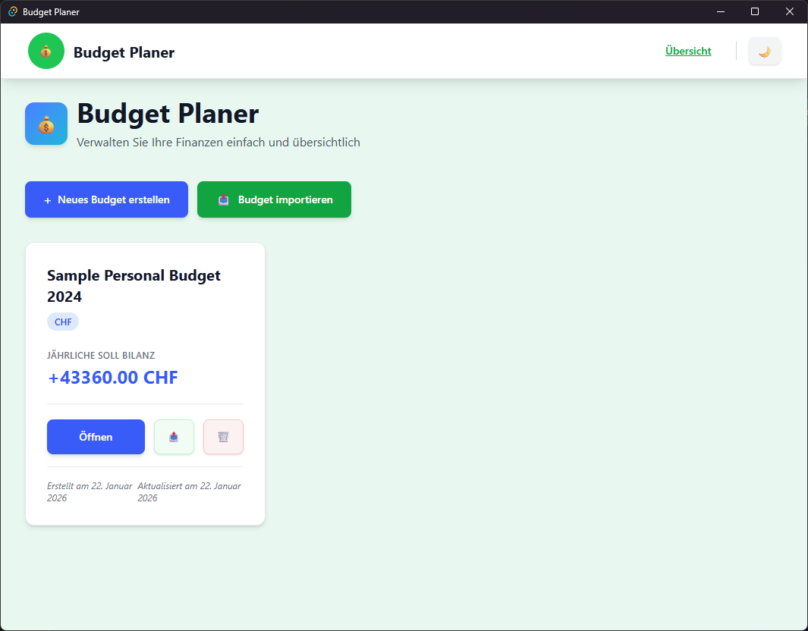
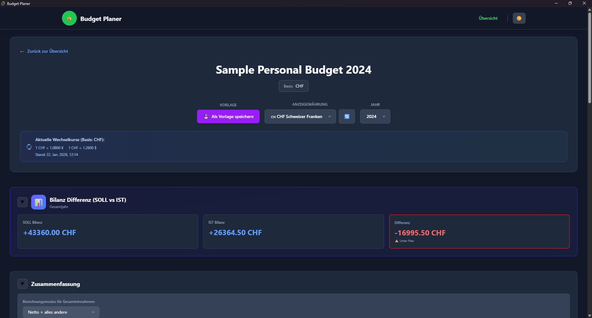
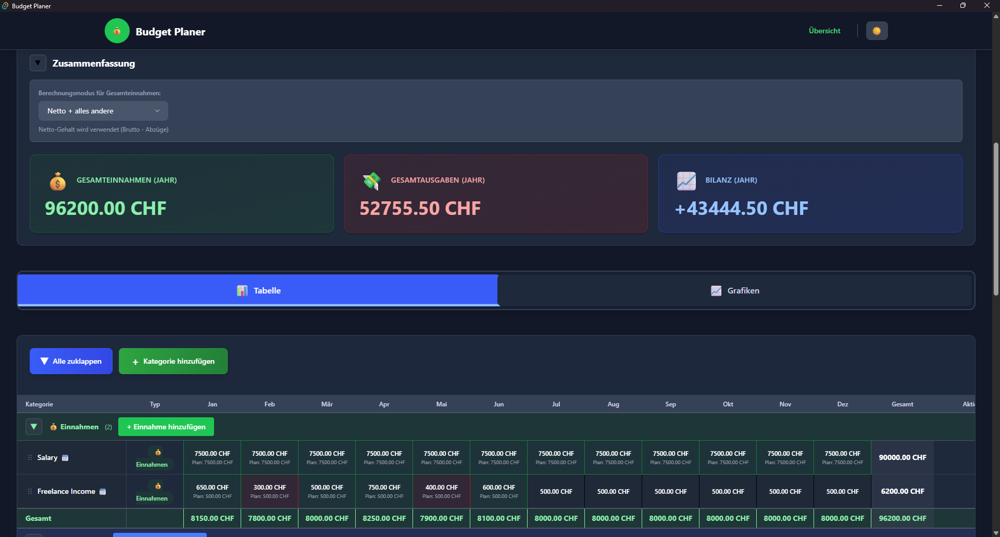
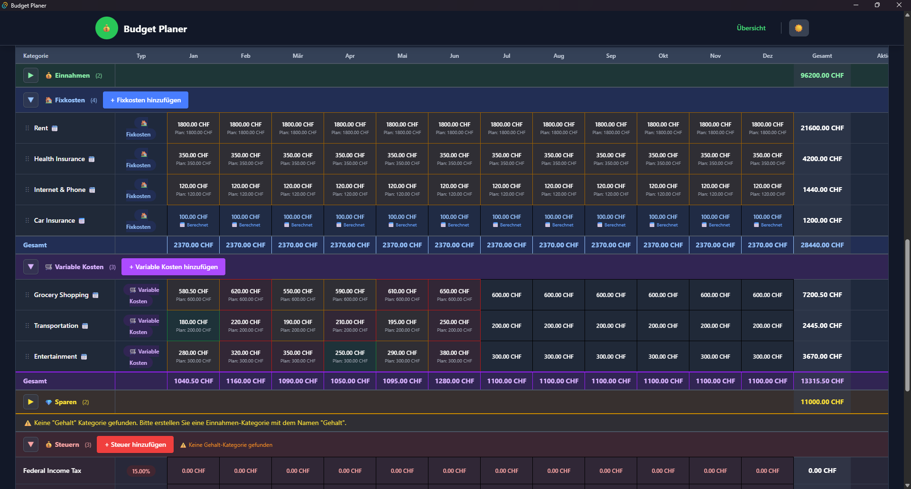
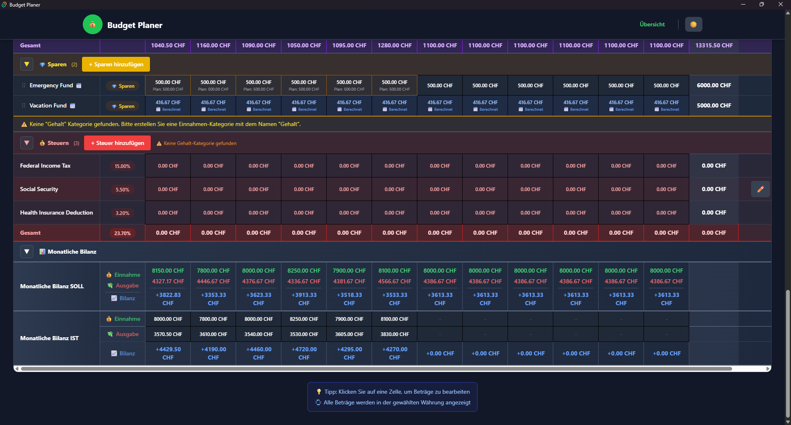

# Budget Planer

A modern budget planning application with monthly overview, tax calculation, and salary deductions. Available as both a web application and a native desktop app built with Tauri.

## Features

- ✅ **Monthly and yearly budget overview** - Track your finances across the entire year
- ✅ **Multiple input modes** - Flexible data entry options:
  - **Monthly**: Enter amounts for each month individually
  - **Yearly**: Annual amount automatically distributed across 12 months
  - **Custom Period**: Distribute amount across X months per year (e.g., quarterly payments)
- ✅ **Category management** - Organize your budget with four category types:
  - Income
  - Fixed Expenses
  - Variable Expenses
  - Savings
- ✅ **Salary deductions** - Calculate net salary from gross with:
  - Percentage-based deductions (e.g., social security)
  - Fixed amount deductions (e.g., health insurance)
- ✅ **Tax calculation** - Automatic tax calculation based on gross salary percentage
- ✅ **Gross to Net salary conversion** - Automatically calculate net income after deductions
- ✅ **Currency conversion** - Support for multiple currencies (CHF, EUR, USD) with live exchange rates
- ✅ **Budget templates** - Save categories as templates for reuse
- ✅ **Drag & Drop** - Reorder categories with intuitive drag-and-drop
- ✅ **Visual analytics** - Comprehensive charts and graphs:
  - Monthly income vs expenses line chart
  - Monthly balance trend
  - Planned vs actual comparison
  - Category distribution pie chart
  - Expense breakdown by type
- ✅ **Actual balance tracking** - Record and compare actual vs planned balances
- ✅ **Budget import/export** - Import and export budgets as JSON files
- ✅ **Internationalization (i18n)** - Full support for multiple languages (German, English) with automatic detection and language switcher
- ✅ **Dark mode** - Full dark mode support for comfortable viewing
- ✅ **Desktop app** - Native desktop application for Windows, Linux, and macOS (via Tauri)

## Screenshots

### Overview

**Dark Mode:**


**Light Mode:**


## Quick Start

### Prerequisites

- Python 3.10 or higher
- [uv](https://github.com/astral-sh/uv) - Python package manager
  ```bash
  curl -LsSf https://astral.sh/uv/install.sh | sh
  ```
- [bun](https://bun.sh) - JavaScript runtime
  ```bash
  curl -fsSL https://bun.sh/install | bash
  ```

### Installation and Start

1. **Clone or download the repository**

2. **Make the start script executable:**
   ```bash
   chmod +x start.sh
   ```

3. **Start the servers:**
   ```bash
   ./start.sh
   ```

   The script will automatically:
   - Check for required dependencies
   - Create a Python virtual environment
   - Install all Python dependencies
   - Install all frontend dependencies
   - Run database migrations
   - Start both backend and frontend servers

4. **Access the application:**
   - Open your browser and go to: http://localhost:5173

5. **Stop the servers:**
   Press `Ctrl+C` in the terminal

### Setup Only (Without Starting Servers)

To install dependencies without starting the servers:

```bash
./start.sh --setup-only
```

## Getting Started

> **Tip**: You can change the application language at any time using the language selector in the header. The application supports German and English.

### 1. Create a New Budget

- Click on "Create New Budget" (or "Neues Budget erstellen" in German)
- Enter a name and select the year
- The budget will be created with CHF as the default currency

### 2. Add Categories

- Click on "+ Add Category" (or "+ Kategorie hinzufügen" in German)
- Choose the category type:
  - **Income**: Money coming in (e.g., Salary)
  - **Fixed Expense**: Regular fixed costs (e.g., Rent, Insurance)
  - **Variable Expense**: Variable costs (e.g., Groceries, Utilities)
  - **Savings**: Money set aside for savings
- Configure the input mode:
  - **Monthly**: Enter amounts for each month separately
  - **Yearly**: Enter total annual amount (automatically divided by 12)
  - **Custom Period**: Enter total amount and specify how many times per year (e.g., 4x for quarterly)

### 3. Enter Amounts

- Click on any cell in the monthly grid
- Enter planned and actual amounts
- The system automatically calculates totals and balances

**Sample Budget View:**









### 4. Configure Salary Deductions

- In the budget editor, find the "Salary Reductions" section
- Add deductions (e.g., social security, health insurance)
- Choose between percentage-based or fixed amount reductions
- Net salary is automatically calculated: Gross Salary - Deductions

### 5. Configure Taxes

- In the budget editor, find the "Taxes" section
- Add tax entries with percentage of gross salary
- Taxes are automatically calculated and added to expenses

### 6. View Analytics

- Navigate to the "Graphs" tab in the budget editor
- View various visualizations:
  - Monthly income vs expenses
  - Balance trends
  - Category distributions
  - Planned vs actual comparisons

### 7. Track Actual Balances

- Enter actual monthly balances to compare with planned values
- View differences in the "Balance Difference" card
- See visual comparisons in the graphs

## Desktop Application

The application is available as a native desktop app for Windows, Linux, and macOS. Pre-built installers are available in the Releases section of the repository.

### Installation (Recommended for Windows)

**For Windows users, the easiest way to get started:**

1. Go to the [Releases](https://github.com/yourusername/Budget-Planer/releases) page
2. Download the latest `.exe` installer (e.g., `Budget-Planer_1.0.0_x64-setup.exe`)
3. Run the downloaded `.exe` file
4. Follow the installation wizard
5. Launch the application from your Start menu or desktop shortcut

**Prerequisites for Windows:**
- Windows 10 or higher
- WebView2 Runtime (usually pre-installed on Windows 10/11)

### Installation for Other Platforms

**Linux:**
- Download the `.AppImage` or `.deb` package from the Releases page
- For `.AppImage`: Make it executable (`chmod +x`) and run it
- For `.deb`: Install using your package manager
- Prerequisites: Modern Linux distribution with GTK support

**macOS:**
- Download the `.dmg` file from the Releases page
- Open the `.dmg` and drag the application to your Applications folder
- Prerequisites: macOS 10.15 or higher

### Troubleshooting

**Application won't start:**
- Make sure you have the latest version installed
- Check that your system meets the minimum requirements
- Try reinstalling the application

## Currency Support

The application supports multiple currencies with automatic conversion:

- **Supported Currencies**: CHF (Swiss Francs), EUR (Euros), USD (US Dollars)
- **Exchange Rates**: Automatically updated daily
- **Data Storage**: All amounts are stored in CHF and converted for display

## Supported Languages

The application supports multiple languages:

- **German (Deutsch)** 🇩🇪
- **English** 🇺🇸

The application automatically detects your browser's language preference. You can change the language anytime using the language selector in the header. Your language preference is saved and remembered for future sessions.

## Contributing

Contributions are welcome! Please feel free to submit a Pull Request.

## License

This project is open source. Please check the license file for details.

## Support

For issues, questions, or feature requests, please create an issue in the GitHub repository.

## Acknowledgments

Exchange rates are provided by [exchangerate-api.com](https://www.exchangerate-api.com/).
